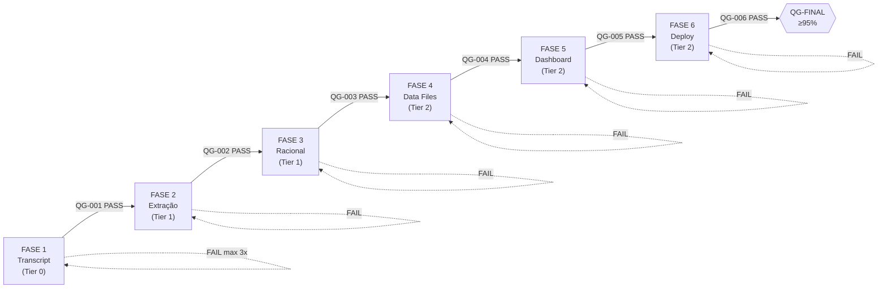

# Pipeline Cohort Intelligence — Transcript to Dashboard

| Field              | Value                                        |
|--------------------|----------------------------------------------|
| **SOP ID**         | SOP-CI-001                                   |
| **Version**        | 1.2.0                                        |
| **Effective Date** | 2026-03-18                                   |
| **Department**     | Data Intelligence / Cohort Operations        |
| **Author**         | Gerber (SOP Creator Agent)                   |
| **Reviewer**       | Cohort Chief (Orchestrator)                  |
| **Approver**       | Tech Lead                                    |
| **Next Review**    | 2026-09-18                                   |
| **Classification** | Internal                                     |
| **Status**         | DRAFT                                        |
| **Keywords**       | cohort, pipeline, transcript, dashboard, insights, Vercel, React, TypeScript, quality-gates |

> **Squad fonte:** `cohort-intelligence` (pro4). Este SOP documenta o pipeline completo de 6 fases com quality gates bloqueantes para transformar gravações de calls de cohort em dashboards interativos deployados na Vercel.

---

## Sumário

- [1. Objetivo](#1-objetivo)
- [2. Escopo](#2-escopo)
- [3. Definições e Abreviações](#3-definições-e-abreviações)
- [4. Pré-requisitos](#4-pré-requisitos)
- [5. Trigger](#5-trigger)
- [6. Procedimento — 6 Fases](#6-procedimento--6-fases)
- [7. Validação Final (QG-FINAL)](#7-validação-final-qg-final)
- [8. Resultado Esperado](#8-resultado-esperado)
- [9. Pontos de Decisão](#9-pontos-de-decisão)
- [10. Troubleshooting](#10-troubleshooting)
- [11. Referências](#11-referências)
- [12. Processo de Aprovação](#12-processo-de-aprovação)
- [13. Histórico de Revisões](#13-histórico-de-revisões)
- [Apêndice A: Resumo dos Quality Gates](#apêndice-a-resumo-dos-quality-gates)
- [Apêndice B: Taxonomia de 15 Tipos de Insight](#apêndice-b-taxonomia-de-15-tipos-de-insight)
- [Apêndice C: Quick Reference Card](#apêndice-c-quick-reference-card)
- [Apêndice D: RACI Matrix](#apêndice-d-raci-matrix)

---

## Executive Summary

Este SOP define um pipeline de 6 fases para transformar transcrições de calls de cohort em dashboards interativos deployados na Vercel. Cada fase possui um Quality Gate bloqueante — falha em qualquer gate interrompe o pipeline até correção. O threshold de completude é >= 95%: cada insight extraído do source DEVE aparecer no dashboard final. Tempo estimado do pipeline completo: 2-4 horas. Operação tipo READ-DO (leia cada passo e execute sequencialmente).

---

## 1. Objetivo

Garantir que qualquer operador consiga transformar uma gravação de call de cohort em um dashboard interativo deployado, seguindo um processo repetível de 6 fases. O pipeline converte transcripts brutos em aplicações React com visualização completa de insights — sem perda de informação.

**Filosofia central:** *"Sem preguiça"* — cada insight do source DEVE aparecer no output final. Completude é medida programaticamente, não subjetivamente.

**Linguagem mandatória neste documento:** "DEVE" (MUST) = obrigatório, falha é bloqueante. "DEVERIA" (SHOULD) = recomendado, falha gera warning. "PODE" (MAY) = opcional.

---

## 2. Escopo

**In Scope:**
- Pipeline completo: transcript bruto → dashboard Vercel live
- 6 fases sequenciais com quality gates bloqueantes
- Processamento de transcripts de qualquer fonte (Fathom, Zoom, manual)
- Extração de insights por participante (15 tipos)
- Análise técnica profunda por tópico
- Geração de data files TypeScript
- Build de dashboard React no ps-hub
- Deploy na Vercel

**Out of Scope:**
- Gravação das calls (responsabilidade do facilitador)
- Manutenção do Design System LUXE
- Criação de novos tipos de insight além dos 15 definidos
- Alterações na arquitetura do ps-hub

**Aplicabilidade:**
Operadores que executam o pipeline via Claude Code com o squad `cohort-intelligence` ativo.

---

## 3. Definições e Abreviações

| Termo | Definição |
|-------|-----------|
| **Cohort** | Grupo de participantes em programa de mentoria/aceleração |
| **Slug** | Identificador curto do cohort (ex: `psa2`, `imersao-1`) |
| **ps-hub** | Aplicação React unificada que hospeda todos os dashboards de cohort como rotas |
| **LUXE** | Design System visual usado nos dashboards (dark theme, animações Framer Motion) |
| **Quality Gate (QG)** | Checkpoint bloqueante automatizado — falha = pipeline PARA |
| **Racional Técnico** | Análise técnica profunda que conecta insights a princípios de engenharia |
| **Insight Type** | Classificação do insight: PERGUNTA, RESPOSTA, INSIGHT, SUGESTAO, PROCESSO, DICA, CONTEXTO, PROBLEMA, IDEIA, ARQUITETURA, DESCOBERTA, MECANISMO, USO_REAL, BENCHMARK, CONFIG |
| **Tier** | Nível de complexidade da fase (0=simples, 1=intermediário, 2=complexo) |
| **PSA2** | Gold standard — primeiro cohort processado que validou todo o pipeline |
| **Pipeline State** | Arquivo JSON que rastreia progresso de cada fase |

---

## 4. Pré-requisitos

### 4.1 Ambiente e Ferramentas

| Item | Especificação | Obrigatório |
|------|---------------|-------------|
| Node.js | v18+ | Sim |
| pnpm | Última versão | Sim |
| TypeScript | v5+ | Sim |
| Vercel CLI | Última versão (`npm i -g vercel`) | Sim |
| Claude Code | Com squad cohort-intelligence | Sim |
| Git | Configurado com acesso ao repo | Sim |

### 4.2 Competências do Operador

| Competência | Nível Mínimo | Como Verificar |
|-------------|-------------|----------------|
| TypeScript / JavaScript | Intermediário — leitura e edição de arquivos `.ts` com type interfaces | Consegue corrigir erros de `tsc --noEmit` sem assistência |
| React (JSX/TSX) | Básico — entende estrutura de componentes e props | Consegue identificar qual componente renderiza qual dado |
| Claude Code | Operacional — sabe ativar squads e executar tasks | Já executou pelo menos 1 pipeline completo com supervisão |
| Git | Básico — add, commit, branch, status | Consegue criar branch e commitar sem auxílio |
| Terminal / CLI | Intermediário — executa comandos bash, interpreta outputs | Consegue diagnosticar falhas de build a partir do log |
| Vercel | Básico — deploy e rollback | Já fez pelo menos 1 deploy com `vercel --prod` |

**Certificação:** Operadores novos DEVEM executar o pipeline completo 1 vez no cohort PSA2 (gold standard) com supervisão de um operador certificado antes de operar de forma autônoma.

### 4.3 Acesso

| Recurso | Detalhe |
|---------|---------|
| Repositório pro4 | Clone local com branch atualizada |
| Vercel | Autenticado (`vercel whoami` retorna user) |
| Transcript | Arquivo .txt, .vtt ou .srt da call |

### 4.4 Treinamento e Distribuição

**Lista de Distribuição:**

| Role | Acesso | Notificação |
|------|--------|-------------|
| Operadores do pipeline | Leitura + Execução | A cada nova versão do SOP |
| Facilitadores de cohort | Leitura (Seções 1-5 e Trigger) | Quando nova call é gravada |
| Tech Lead | Leitura + Aprovação | A cada revisão do SOP |
| Squad Owner (cohort-intelligence) | Leitura + Governança | A cada mudança de infraestrutura |

**Onboarding de Novos Operadores:**
1. Ler este SOP completo (tempo estimado: 30 min)
2. Executar o pipeline PSA2 com supervisão (gold standard)
3. Passar no checklist de verificação com operador certificado
4. Registrar conclusão no log de treinamento

**Registro de Treinamento:**

| Operador | Data Treinamento | Supervisor | Pipeline Executado | Status |
|----------|-----------------|------------|-------------------|--------|
| _(preencher)_ | _(data)_ | _(nome)_ | PSA2 | _(APROVADO/REPROVADO)_ |

### 4.5 Verificação Pré-execução

```bash
# Verificar ambiente
node --version        # >= 18
pnpm --version        # instalado
vercel whoami         # autenticado
tsc --version         # >= 5

# Verificar que ps-hub builda
cd apps/ps-hub && pnpm run build
```

- [ ] Node.js 18+ instalado
- [ ] pnpm instalado
- [ ] Vercel CLI autenticado
- [ ] TypeScript 5+ disponível
- [ ] ps-hub builda sem erros
- [ ] Transcript disponível

---

## 5. Trigger

**Quando executar:** Sempre que uma nova call de cohort é gravada e o transcript está disponível.

**Inputs necessários:**
1. Arquivo de transcript bruto (`.txt`, `.vtt`, ou `.srt`)
2. Nome do cohort (para gerar o slug)
3. Data da sessão

**Quem inicia:** Operador do pipeline ou facilitador do cohort.

---

## 6. Procedimento — 6 Fases

### Visão Geral do Pipeline



**Regra fundamental:** Cada fase só DEVE iniciar após o Quality Gate da fase anterior PASSAR. Sem exceções.

---

### FASE 1: Processar Transcript

| Campo | Valor |
|-------|-------|
| **Task** | `process-transcript` |
| **Executor** | transcript-processor (agent) |
| **Tier** | 0 (simples) |
| **Classificação Cognitiva** | Automático |
| **Tempo estimado** | 10-15 min |
| **Input** | Transcript bruto (.txt/.vtt/.srt) |
| **Output** | `calls/transcripts/{cohort}-clean.md` |

#### Passos

1. [ ] **Validar input** — Verificar que o transcript existe e tem conteúdo
   ```bash
   wc -w transcript-bruto.txt  # Deve ter > 500 palavras
   ```

2. [ ] **Executar task** — No Claude Code com o squad ativo:
   ```
   Execute a task process-transcript com o arquivo: [path/to/transcript]
   Cohort: [nome-do-cohort]
   ```

3. [ ] **O que o agent faz:**
   - Remove filler words (uh, uhm, tipo, né)
   - Identifica e rotula speakers (`### Speaker Name`)
   - Adiciona timestamps se ausentes
   - Remove cross-talk e repetições
   - Normaliza nomes de participantes
   - Formata como markdown limpo com seções por speaker

4. [ ] **Verificar output** — Confirmar que o arquivo foi gerado:
   ```bash
   ls -la calls/transcripts/{cohort}-clean.md
   ```

#### Quality Gate QG-001: Transcript Ready

**Tipo:** BLOCKING — falha = pipeline PARA

```bash
# Check 1: Arquivo existe
[ -f "calls/transcripts/{cohort}-clean.md" ] || echo "FAIL: Transcript limpo não encontrado"

# Check 2: Word count > 1000
WORDS=$(wc -w < "calls/transcripts/{cohort}-clean.md")
[ "$WORDS" -gt 1000 ] || echo "FAIL: Transcript muito curto ($WORDS palavras, precisa > 1000)"

# Check 3: Tem headers de speakers (formato ###)
SPEAKERS=$(grep -c "^### " "calls/transcripts/{cohort}-clean.md")
[ "$SPEAKERS" -gt 1 ] || echo "FAIL: Seções de speakers não encontradas"

# Check 4: Tem timestamps
grep -q "[0-9]:[0-9][0-9]" "calls/transcripts/{cohort}-clean.md" || echo "FAIL: Timestamps ausentes"
```

| Critério | PASS | FAIL |
|----------|------|------|
| Arquivo existe | ✓ Presente | ✗ STOP: Execute process-transcript primeiro |
| > 1000 palavras | ✓ Acima do threshold | ✗ STOP: Transcript muito curto para extração |
| >= 2 speakers | ✓ Múltiplos speakers | ✗ STOP: Análise de cohort requer múltiplos speakers |
| Timestamps | ✓ Presentes | ⚠ WARN: Continua com qualidade degradada |

**Decisão:** PASS → ir para Fase 2 | FAIL → corrigir e re-executar Fase 1 (max 3 tentativas)

---

### FASE 2: Extrair Insights

| Campo | Valor |
|-------|-------|
| **Task** | `extract-insights` |
| **Executor** | insight-extractor (agent) |
| **Tier** | 1 (intermediário) |
| **Classificação Cognitiva** | Híbrido (agent extrai, operador valida) |
| **Tempo estimado** | 20-30 min |
| **Input** | Transcript limpo (`calls/transcripts/{cohort}-clean.md`) |
| **Output** | `calls/summaries/{cohort}-insights-extraction.md` |

#### Passos

1. [ ] **Confirmar QG-001 passou** — Não inicie sem o gate anterior aprovado

2. [ ] **Executar task** — No Claude Code:
   ```
   Execute a task extract-insights para o cohort: [nome-do-cohort]
   ```

3. [ ] **O que o agent faz:**
   - Lê transcript limpo
   - Identifica insights por participante
   - Classifica cada insight em um dos 15 tipos:
     - `PERGUNTA` — Questão levantada
     - `RESPOSTA` — Resposta fornecida
     - `INSIGHT` — Observação ou realização
     - `SUGESTAO` — Recomendação acionável
     - `PROCESSO` — Processo descrito
     - `DICA` — Tip prático
     - `CONTEXTO` — Informação contextual
     - `PROBLEMA` — Issue ou blocker
     - `IDEIA` — Ideia nova
     - `ARQUITETURA` — Decisão arquitetural
     - `DESCOBERTA` — Descoberta empírica
     - `MECANISMO` — Mecanismo explicado
     - `USO_REAL` — Caso de uso real
     - `BENCHMARK` — Dado comparativo
     - `CONFIG` — Configuração específica
   - Gera tabela de insights por participante
   - Identifica temas cross-cutting
   - Lista ações sugeridas

4. [ ] **Formato esperado no output:**
   ```markdown
   ### Participant Name

   | # | Tipo | Insight | Contexto |
   |---|------|---------|----------|
   | 1 | PERGUNTA | "Como validamos...?" | Discussão sobre MVP |
   | 2 | INSIGHT | "O maior risco é..." | Análise de mercado |
   ...

   ## Mapa de Temas
   ...

   ## Ações Sugeridas
   ...
   ```

5. [ ] **Verificar output** — Confirmar geração:
   ```bash
   ls -la calls/summaries/{cohort}-insights-extraction.md
   ```

#### Quality Gate QG-002: Extraction Complete

**Tipo:** BLOCKING

```bash
# Check 1: Arquivo existe
[ -f "calls/summaries/{cohort}-insights-extraction.md" ] || echo "FAIL: Arquivo de extração não encontrado"

# Check 2: Todos os speakers do transcript presentes
TRANSCRIPT_SPEAKERS=$(grep -c "^### " "calls/transcripts/{cohort}-clean.md")
EXTRACTION_SPEAKERS=$(grep -c "^### " "calls/summaries/{cohort}-insights-extraction.md")
[ "$EXTRACTION_SPEAKERS" -ge "$TRANSCRIPT_SPEAKERS" ] || echo "FAIL: Speakers faltando ($EXTRACTION_SPEAKERS/$TRANSCRIPT_SPEAKERS)"

# Check 3: Tem tabelas de insights (formato | # | Tipo |)
TABLES=$(grep -c "^| [0-9]" "calls/summaries/{cohort}-insights-extraction.md")
[ "$TABLES" -gt 10 ] || echo "FAIL: Poucos insights extraídos ($TABLES, precisa > 10)"

# Check 4: Tem seção de temas
grep -q "## Mapa de Temas" "calls/summaries/{cohort}-insights-extraction.md" || echo "FAIL: Seção de temas ausente"

# Check 5: Tem seção de ações
grep -q "## Acoes Sugeridas\|## Ações Sugeridas" "calls/summaries/{cohort}-insights-extraction.md" || echo "FAIL: Seção de ações ausente"
```

| Critério | PASS | FAIL |
|----------|------|------|
| Arquivo existe | ✓ | ✗ STOP: Execute extract-insights |
| >= 100% speakers | ✓ Todos presentes | ✗ STOP: Extração fatalmente incompleta |
| >= 3 insights/speaker | ✓ Profundidade OK | ✗ STOP: Extração muito rasa |
| Seção de temas | ✓ Presente | ✗ STOP: Análise cross-cutting ausente |
| Seção de ações | ✓ Presente | ⚠ WARN: Pode ser adicionada depois |

**Decisão:** PASS → ir para Fase 3 | FAIL → corrigir e re-executar Fase 2

---

### FASE 3: Gerar Racional Técnico

| Campo | Valor |
|-------|-------|
| **Task** | `generate-racional` |
| **Executor** | technical-analyst (agent) |
| **Tier** | 1 (intermediário) |
| **Classificação Cognitiva** | Automático (extended thinking) |
| **Tempo estimado** | 25-40 min |
| **Input** | `calls/summaries/{cohort}-insights-extraction.md` |
| **Output** | `calls/summaries/{cohort}-racional-tecnico.md` |

#### Passos

1. [ ] **Confirmar QG-002 passou**

2. [ ] **Executar task** — No Claude Code:
   ```
   Execute a task generate-racional para o cohort: [nome-do-cohort]
   ```

3. [ ] **O que o agent faz:**
   - Lê insights extraídos
   - Identifica tópicos por participante
   - Para cada tópico gera 4 subsections:
     1. **Racional técnico** — Análise profunda
     2. **Por que funciona** — Fundamentação em princípios de engenharia
     3. **Gaps e limitações** — O que ficou de fora
     4. **O que foi subestimado** — Pontos cegos
   - Conecta insights entre participantes
   - Gera tabela de síntese (padrões → princípios IT)
   - Referencia frameworks e princípios de engenharia

4. [ ] **Formato esperado:**
   ```markdown
   ### Participant Name

   #### Tópico: [Nome do Tópico]

   **Racional técnico:**
   [Análise profunda...]

   **Por que funciona:**
   [Fundamentação em princípios...]

   **Gaps e limitações:**
   [O que ficou de fora...]

   **O que foi subestimado:**
   [Pontos cegos...]

   ---

   ## Síntese
   | Padrão | Princípio IT | Participantes |
   |--------|-------------|---------------|
   | ... | ... | ... |
   ```

5. [ ] **Verificar output:**
   ```bash
   ls -la calls/summaries/{cohort}-racional-tecnico.md
   ```

#### Quality Gate QG-003: Racional Complete

**Tipo:** BLOCKING

```bash
# Check 1: Arquivo existe
[ -f "calls/summaries/{cohort}-racional-tecnico.md" ] || echo "FAIL: Racional não encontrado"

# Check 2: Cobertura de tópicos
EXTRACTION_TOPICS=$(grep -c "^### Topico:\|^### Tópico:" "calls/summaries/{cohort}-insights-extraction.md")
RACIONAL_TOPICS=$(grep -c "^### Topico:\|^### Tópico:\|^#### Tópico:\|^#### Topico:" "calls/summaries/{cohort}-racional-tecnico.md")
COVERAGE=$((RACIONAL_TOPICS * 100 / EXTRACTION_TOPICS))
[ "$COVERAGE" -ge 70 ] || echo "FAIL: Cobertura de tópicos baixa ($COVERAGE%, precisa >= 70%)"

# Check 3: Tem tabela de síntese
grep -q "## Sintese\|## Síntese" "calls/summaries/{cohort}-racional-tecnico.md" || echo "FAIL: Tabela de síntese ausente"

# Check 4: Profundidade técnica
DEPTH=$(grep -ci "arquitetura\|pattern\|principio\|design\|sistema\|framework" "calls/summaries/{cohort}-racional-tecnico.md")
[ "$DEPTH" -gt 20 ] || echo "WARN: Análise pode estar rasa ($DEPTH termos técnicos)"
```

| Critério | PASS | FAIL |
|----------|------|------|
| Arquivo existe | ✓ | ✗ STOP: Execute generate-racional |
| >= 70% tópicos cobertos | ✓ | ✗ STOP: Análise incompleta |
| Tabela de síntese | ✓ Presente | ✗ STOP: Síntese ausente |
| >= 20 termos técnicos | ✓ Profundidade OK | ⚠ WARN: Pode faltar profundidade |

**Decisão:** PASS → ir para Fase 4 | FAIL → corrigir e re-executar Fase 3

---

### FASE 4: Gerar Data Files TypeScript

| Campo | Valor |
|-------|-------|
| **Task** | `generate-data-files` |
| **Executor** | data-generator (agent) |
| **Tier** | 2 (complexo) |
| **Classificação Cognitiva** | Automático |
| **Tempo estimado** | 45-60 min |
| **Input** | `{cohort}-insights-extraction.md` + `{cohort}-racional-tecnico.md` |
| **Output** | 7 arquivos TypeScript em `apps/ps-hub/cohorts/{slug}/data/` |

#### Passos

1. [ ] **Confirmar QG-003 passou**

2. [ ] **Executar task** — No Claude Code:
   ```
   Execute a task generate-data-files para o cohort: [nome-do-cohort]
   Slug: [slug-do-cohort]
   ```

3. [ ] **O que o agent faz:**

   **Sub-fase A — Análise de Referência:**
   - Lê implementação PSA2 (`apps/psa2/data/`) como referência
   - Extrai type interfaces e patterns

   **Sub-fase B — Parse do Extraction MD:**
   - Extrai estatísticas da sessão (participantes, duração, temas, ações, insights)
   - Gera `stats.ts`
   - Parse timeline de participantes com timestamps e insights
   - Gera `participants.ts` com TYPE_COLORS e TYPE_ICONS
   - Parse temas cross-cutting → `themes.ts`
   - Parse ações sugeridas com prioridades → `actions.ts`
   - Parse deep-dives do featured speaker (se existir) → `deep-dives.ts`

   **Sub-fase C — Parse do Racional MD:**
   - Extrai tópicos técnicos com seções
   - Extrai tabela de síntese
   - Gera `racional-tecnico.ts`

   **Sub-fase D — Index e Validação:**
   - Gera `index.ts` (barrel exports)
   - Roda TypeScript compiler

4. [ ] **Arquivos gerados (7):**

   | Arquivo | Conteúdo |
   |---------|----------|
   | `stats.ts` | Estatísticas da sessão |
   | `participants.ts` | Dados de cada participante + insights |
   | `themes.ts` | Temas cross-cutting |
   | `actions.ts` | Ações sugeridas com prioridade |
   | `racional-tecnico.ts` | Análise técnica estruturada |
   | `deep-dives.ts` | Deep-dives do featured speaker (condicional) |
   | `index.ts` | Barrel exports de todos os módulos |

5. [ ] **Verificar compilação manualmente:**
   ```bash
   cd apps/ps-hub && npx tsc --noEmit
   ```

#### Quality Gate QG-004: Data Files Compile

**Tipo:** BLOCKING

```bash
# Check 1: Todos os arquivos obrigatórios existem
for FILE in stats.ts participants.ts deep-dives.ts themes.ts actions.ts racional-tecnico.ts index.ts; do
  [ -f "apps/ps-hub/cohorts/{slug}/data/$FILE" ] || echo "FAIL: Faltando data/$FILE"
done

# Check 2: TypeScript compila
cd apps/ps-hub && npx tsc --noEmit 2>&1
TSC_EXIT=$?
[ "$TSC_EXIT" -eq 0 ] || echo "FAIL: Compilação TypeScript falhou"

# Check 3: Completude de participantes
EXTRACTION_PARTICIPANTS=$(grep -c "^### [0-9]" "calls/summaries/{cohort}-insights-extraction.md")
DATA_PARTICIPANTS=$(grep -c "name:" "apps/ps-hub/cohorts/{slug}/data/participants.ts")
[ "$DATA_PARTICIPANTS" -ge "$EXTRACTION_PARTICIPANTS" ] || echo "FAIL: Participantes faltando ($DATA_PARTICIPANTS/$EXTRACTION_PARTICIPANTS)"

# Check 4: Barrel exports completos
EXPORTS=$(grep -c "^export" "apps/ps-hub/cohorts/{slug}/data/index.ts")
[ "$EXPORTS" -ge 6 ] || echo "FAIL: Exports incompletos ($EXPORTS, precisa >= 6)"
```

| Critério | PASS | FAIL |
|----------|------|------|
| 7 arquivos presentes | ✓ | ✗ STOP: Regenerar data files |
| `tsc --noEmit` passa | ✓ | ✗ STOP: Corrigir erros de compilação |
| Contagem participantes = source | ✓ | ✗ STOP: Data files incompletos |
| >= 6 barrel exports | ✓ | ✗ STOP: Barrel file incompleto |

**Decisão:** PASS → ir para Fase 5 | FAIL → corrigir e re-executar Fase 4

---

### FASE 5: Build Dashboard

| Campo | Valor |
|-------|-------|
| **Task** | `build-dashboard` |
| **Executor** | dashboard-builder (agent) |
| **Tier** | 2 (complexo) |
| **Classificação Cognitiva** | Automático |
| **Tempo estimado** | 30-60 min |
| **Input** | Data files TypeScript |
| **Output** | Rota React no ps-hub em `apps/ps-hub/cohorts/{slug}/` |

#### Passos

1. [ ] **Confirmar QG-004 passou**

2. [ ] **Executar task** — No Claude Code:
   ```
   Execute a task build-dashboard para o cohort: [nome-do-cohort]
   Slug: [slug-do-cohort]
   ```

3. [ ] **O que o agent faz:**

   **Sub-fase A — Verificar Hub e Data:**
   - Verifica que ps-hub builda
   - Verifica data files existem e compilam

   **Sub-fase B — Criar Componentes React (organisms):**
   - `HeroSection.tsx` — Header com título e stats
   - `StatsBar.tsx` — Barra de estatísticas
   - `ParticipantsTimeline.tsx` — Timeline de participantes
   - `RacionalTecnicoSection.tsx` — Seção de análise técnica
   - `ThemesGrid.tsx` — Grid de temas
   - `ActionsSection.tsx` — Seção de ações
   - `Footer.tsx` — Rodapé
   - `DeepDive.tsx` (opcional) — Deep-dive do featured speaker
   - Todos usam LUXE design system (dark theme, Framer Motion)

   **Sub-fase C — Integrar no Hub:**
   - Cria `{Slug}InsightsReport.tsx` (wrapper component)
   - Adiciona nova rota em `App.tsx`: `/{slug}`
   - Atualiza `cohorts.generated.ts` com metadata
   - Copia MDs do source para `public/` (para downloads)

   **Sub-fase D — Build e Validação:**
   - Roda `tsc --noEmit`
   - Roda `pnpm run build`
   - Verifica que dist/ foi gerado

4. [ ] **Verificar build manualmente:**
   ```bash
   cd apps/ps-hub && pnpm run build
   ls -la dist/index.html
   ```

5. [ ] **Preview local (opcional):**
   ```bash
   cd apps/ps-hub && pnpm run preview
   # Abrir http://localhost:4173/{slug} no browser
   ```

#### Quality Gate QG-005: Dashboard Builds

**Tipo:** BLOCKING

```bash
# Check 1: Diretório do app existe
[ -d "apps/ps-hub/cohorts/{slug}" ] || echo "FAIL: Diretório do cohort não encontrado"

# Check 2: Dependências instaladas
[ -d "apps/ps-hub/node_modules" ] || echo "FAIL: Rode pnpm install primeiro"

# Check 3: Build passa
cd apps/ps-hub && pnpm run build 2>&1
BUILD_EXIT=$?
[ "$BUILD_EXIT" -eq 0 ] || echo "FAIL: Build falhou"

# Check 4: dist/ tem conteúdo
[ -f "apps/ps-hub/dist/index.html" ] || echo "FAIL: Build output ausente"
DIST_SIZE=$(du -s "apps/ps-hub/dist/" | cut -f1)
[ "$DIST_SIZE" -gt 100 ] || echo "FAIL: Build output muito pequeno"

# Check 5: Source MDs em public/ para download
ls apps/ps-hub/public/*-extraction.md 2>/dev/null || echo "WARN: Extraction MD não está em public/ — botão de download não funcionará"
ls apps/ps-hub/public/*-racional*.md 2>/dev/null || echo "WARN: Racional MD não está em public/ — botão de download não funcionará"
```

| Critério | PASS | FAIL |
|----------|------|------|
| Build passa | ✓ | ✗ STOP: Corrigir erros de build |
| `dist/index.html` existe | ✓ | ✗ STOP: Build não produziu output |
| MDs em `public/` | ✓ | ⚠ WARN: Downloads não funcionarão |

**Decisão:** PASS → ir para Fase 6 | FAIL → corrigir e re-executar Fase 5

---

### FASE 6: Deploy

| Campo | Valor |
|-------|-------|
| **Task** | `deploy` |
| **Executor** | cohort-chief (orchestrator) |
| **Tier** | 2 (complexo) |
| **Classificação Cognitiva** | Automático |
| **Tempo estimado** | 5-10 min |
| **Input** | Dashboard buildado no ps-hub |
| **Output** | URL Vercel live |

#### Passos

1. [ ] **Confirmar QG-005 passou**

2. [ ] **Verificar autenticação Vercel:**
   ```bash
   vercel whoami
   ```

3. [ ] **Verificar artefatos de build:**
   ```bash
   [ -f "apps/ps-hub/dist/index.html" ] && echo "OK" || echo "FAIL: Build ausente"
   du -sh apps/ps-hub/dist/  # Deve ser > 10KB
   ```

4. [ ] **Deploy para produção:**
   ```bash
   cd apps/ps-hub && vercel --prod --yes
   ```

5. [ ] **Aguardar propagação** — Esperar ~15 segundos após deploy

6. [ ] **Health checks:**
   ```bash
   # Hub landing page
   HTTP_HUB=$(curl -s -o /dev/null -w "%{http_code}" "{deployed_url}")
   [ "$HTTP_HUB" -eq 200 ] || echo "FAIL: Hub retorna HTTP $HTTP_HUB"

   # Nova rota do cohort
   HTTP_COHORT=$(curl -s -o /dev/null -w "%{http_code}" "{deployed_url}/{slug}")
   [ "$HTTP_COHORT" -eq 200 ] || echo "FAIL: Cohort retorna HTTP $HTTP_COHORT"

   # Conteúdo não está em branco
   CONTENT_LENGTH=$(curl -s "{deployed_url}/{slug}" | wc -c)
   [ "$CONTENT_LENGTH" -gt 1000 ] || echo "FAIL: Página parece em branco ($CONTENT_LENGTH bytes)"
   ```

7. [ ] **Teste de regressão** — Verificar que rotas existentes ainda funcionam:
   ```bash
   # Para cada cohort existente
   curl -s -o /dev/null -w "%{http_code}" "{deployed_url}/psa2"  # Deve ser 200
   ```

8. [ ] **Registrar URL final** — Anotar a URL do deploy para compartilhar

#### Quality Gate QG-006: Deploy Success

**Tipo:** BLOCKING

```bash
# Check 1: Deploy exitou com sucesso
cd apps/ps-hub && vercel --prod --yes 2>&1
DEPLOY_EXIT=$?
[ "$DEPLOY_EXIT" -eq 0 ] || echo "FAIL: Deploy Vercel falhou"

# Check 2: URL acessível
HTTP_CODE=$(curl -s -o /dev/null -w "%{http_code}" "{deployed_url}/{slug}")
[ "$HTTP_CODE" -eq 200 ] || echo "FAIL: URL retorna HTTP $HTTP_CODE"

# Check 3: Página tem conteúdo
CONTENT_LENGTH=$(curl -s "{deployed_url}/{slug}" | wc -c)
[ "$CONTENT_LENGTH" -gt 1000 ] || echo "FAIL: Página em branco ($CONTENT_LENGTH bytes)"
```

| Critério | PASS | FAIL |
|----------|------|------|
| Deploy passa | ✓ | ✗ STOP: Verificar config Vercel |
| HTTP 200 | ✓ | ✗ STOP: Deploy não acessível |
| > 1000 bytes | ✓ | ✗ STOP: Página em branco |

**Decisão:** PASS → ir para Validação Final | FAIL → corrigir e re-deploy

---

## 7. Validação Final (QG-FINAL)

Após todas as 6 fases, executar verificação de completude end-to-end.

### Checklist de Completude

```bash
# Contar items no source vs app
SOURCE_PARTICIPANTS=$(grep -c "^### [0-9]" "calls/summaries/{cohort}-insights-extraction.md")
SOURCE_INSIGHTS=$(grep -c "^| [0-9]" "calls/summaries/{cohort}-insights-extraction.md")

APP_PARTICIPANTS=$(grep -c "name:" "apps/ps-hub/cohorts/{slug}/data/participants.ts")
APP_INSIGHTS=$(grep -c "content:" "apps/ps-hub/cohorts/{slug}/data/participants.ts")

echo "Participantes: $APP_PARTICIPANTS / $SOURCE_PARTICIPANTS"
echo "Insights: $APP_INSIGHTS / $SOURCE_INSIGHTS"

COMPLETENESS=$((APP_INSIGHTS * 100 / SOURCE_INSIGHTS))
echo "Completude: $COMPLETENESS%"
[ "$COMPLETENESS" -ge 95 ] || echo "FAIL: Completude $COMPLETENESS% < 95%"
```

### Checklist Final

- [ ] **Fase 1:** Transcript processado e QG-001 PASS
- [ ] **Fase 2:** Insights extraídos e QG-002 PASS
- [ ] **Fase 3:** Racional técnico gerado e QG-003 PASS
- [ ] **Fase 4:** Data files TypeScript compilando e QG-004 PASS
- [ ] **Fase 5:** Dashboard builda sem erros e QG-005 PASS
- [ ] **Fase 6:** Deploy Vercel live com HTTP 200 e QG-006 PASS
- [ ] **QG-FINAL:** Completude >= 95%
- [ ] **URL registrada** e compartilhada com stakeholders
- [ ] **Pipeline state** atualizado como COMPLETE

**Threshold de completude:** >= 95% (enforcement: *"Sem preguiça"*)

---

## 8. Resultado Esperado

Ao final da execução completa:

1. **Transcript limpo** em `calls/transcripts/{cohort}-clean.md`
2. **Extração de insights** em `calls/summaries/{cohort}-insights-extraction.md`
3. **Racional técnico** em `calls/summaries/{cohort}-racional-tecnico.md`
4. **7 data files TypeScript** em `apps/ps-hub/cohorts/{slug}/data/`
5. **Dashboard React** integrado ao ps-hub como rota `/{slug}`
6. **Deploy Vercel live** acessível via URL pública com HTTP 200
7. **100% de completude** — cada insight do source renderizado no app

---

## 9. Pontos de Decisão

### Árvore de Decisões para Edge Cases

```
Transcript tem < 500 palavras?
├── Sim → STOP: Transcript insuficiente para análise
└── Não → Continuar

Transcript tem apenas 1 speaker?
├── Sim → STOP: Análise de cohort requer múltiplos participantes
└── Não → Continuar

Transcript não tem timestamps?
├── Sim → WARN: Continuar com qualidade degradada (sem timeline)
└── Não → Continuar

Extração cobre < 50% dos speakers?
├── Sim → STOP: Re-executar extract-insights com instrução explícita
└── Não → Continuar

Racional cobre < 70% dos tópicos?
├── Sim → STOP: Re-executar generate-racional
└── Não → Continuar

TypeScript não compila?
├── Sim → STOP: Corrigir erros de tipo e re-executar
└── Não → Continuar

Build do ps-hub falha?
├── Sim → Verificar se é erro nos novos componentes
│   ├── Sim → Corrigir componentes e re-build
│   └── Não → Verificar se é erro no hub (regressão)
└── Não → Continuar

Deploy falha?
├── Sim → Verificar autenticação Vercel
│   ├── Não autenticado → `vercel login`
│   └── Autenticado → Verificar config Vercel
└── Não → Continuar

Completude < 95%?
├── Sim → Identificar itens faltantes e corrigir data files
└── Não → Pipeline COMPLETE ✓
```

---

## 10. Troubleshooting

### Impacto de Falhas por Quality Gate

| Gate | Tempo de Retrabalho | Impacto no Pipeline | Custo Operacional |
|------|---------------------|--------------------|--------------------|
| QG-001 (Transcript) | 10-15 min/tentativa | Bloqueia tudo — nenhuma fase subsequente inicia | Baixo: reprocessamento rápido |
| QG-002 (Extraction) | 20-30 min/tentativa | Bloqueia Fases 3-6 — insights incompletos propagam erros downstream | Médio: retrabalho de extração + validação manual |
| QG-003 (Racional) | 25-40 min/tentativa | Bloqueia Fases 4-6 — racional raso gera data files sem profundidade técnica | Médio: extended thinking consome mais tokens |
| QG-004 (Data Files) | 45-60 min/tentativa | Bloqueia Fases 5-6 — erros de tipo requerem debugging manual | Alto: debugging TypeScript + regeneração parcial |
| QG-005 (Dashboard) | 30-60 min/tentativa | Bloqueia deploy — componentes quebrados requerem correção React | Alto: debugging React + rebuild completo |
| QG-006 (Deploy) | 5-15 min/tentativa | Bloqueia entrega — stakeholders não recebem o dashboard | Médio: geralmente config Vercel, resolução rápida |
| QG-FINAL (<95%) | 60-120 min | Requer auditoria de completude item-a-item entre source e app | Muito Alto: comparação manual insight-por-insight |

**Custo acumulado de falha tardia:** Uma falha no QG-005 que origina de um problema no QG-002 (extração incompleta) gera retrabalho em cascata de 2-4 horas. Por isso cada gate é BLOCKING — detectar cedo é 5-10x mais barato que detectar tarde.

### Erros Comuns

| Problema | Causa Provável | Solução |
|----------|---------------|---------|
| `tsc --noEmit` falha | Tipo incorreto no data file | Verificar interfaces vs PSA2 reference |
| Build falha com import error | Caminho de import errado | Verificar relative imports `../data` |
| Vercel deploy falha | Não autenticado | `vercel login` |
| HTTP 404 na nova rota | Rota não adicionada ao App.tsx | Verificar `App.tsx` tem rota `/{slug}` |
| HTTP 200 mas página em branco | Componente não renderiza dados | Verificar que data é importada corretamente |
| Completude < 95% | Insights perdidos na conversão MD→TS | Comparar extraction MD com participants.ts |
| Speakers faltando na extração | Agent ignorou speakers menores | Re-executar com instrução explícita de 100% speakers |
| Racional raso | Poucos princípios de engenharia | Re-executar com extended thinking |
| Rotas existentes quebradas após deploy | Mudança breaking no hub | Rollback: `vercel rollback` e investigar |

### Análise de Causa Raiz (RCA)

Quando o mesmo quality gate falha 3+ vezes no mesmo cohort, ou 2+ vezes em cohorts diferentes, o operador DEVE executar uma análise de causa raiz antes de tentar novamente.

**Método: 5-Why Rápido**

```
Falha observada: [descrever o sintoma]
├── Por que 1: [causa imediata]
│   └── Por que 2: [causa da causa]
│       └── Por que 3: [causa mais profunda]
│           └── Por que 4: [causa sistêmica]
│               └── Por que 5: [causa raiz]
Ação corretiva: [ação que endereça a causa raiz, não o sintoma]
```

**Exemplo:**
```
Falha observada: QG-004 falha — tsc --noEmit retorna erros de tipo
├── Por que 1: participants.ts tem tipo incompatível
│   └── Por que 2: O agent gerou InsightType como string literal, não como union type
│       └── Por que 3: A referência PSA2 usa uma interface diferente da atual
│           └── Por que 4: A interface foi atualizada no PSA2 mas o agent usa a versão antiga
│               └── Por que 5: Não há single source of truth para type interfaces
Ação corretiva: Criar shared types em types/cohort.d.ts e referenciar em todas as tasks
```

**Quando usar:** Falhas recorrentes (>=3 tentativas) ou falhas que afetam múltiplos cohorts.
**Registro:** Documentar a RCA no pipeline state ou como comentário no commit de correção.

### Escalation

| Nível | Condição | Contato | SLA |
|-------|----------|---------|-----|
| L1 — Operador | Quality gate falha (tentativas 1-2) | Auto-resolução com troubleshooting | Imediato |
| L2 — Tech Lead | 3 falhas consecutivas no mesmo gate | Tech Lead do projeto | 4 horas úteis |
| L3 — Squad Owner | Pipeline bloqueado por issue de infraestrutura (Vercel, ps-hub, Design System) | Owner do squad cohort-intelligence | 1 dia útil |
| L4 — Facilitador | Transcript de qualidade insuficiente (< 500 palavras, 1 speaker) | Facilitador do cohort | Próxima sessão |

**Regra de escalation:** Cada nível DEVE ser tentado antes de escalar ao próximo. Documente o problema e as tentativas de resolução antes de escalar.

### Rollback

Se o deploy causar problemas:

```bash
# Rollback para versão anterior
cd apps/ps-hub && vercel rollback

# Verificar que voltou a funcionar
curl -s -o /dev/null -w "%{http_code}" "{deployed_url}"
```

### Retry Logic

Cada quality gate permite **3 tentativas**. Na terceira falha, o pipeline PARA e escalona para o operador humano.

```
Falha 1 → Agent tenta corrigir automaticamente
Falha 2 → Agent tenta abordagem alternativa
Falha 3 → HALT — escalar para operador
```

---

## 11. Referências

### Arquivos do Squad (pro4)

| Arquivo | Path | Conteúdo |
|---------|------|----------|
| Config | `squads/cohort-intelligence/config.yaml` | Pipeline stages, quality thresholds |
| Workflow | `squads/cohort-intelligence/workflows/cohort-to-dashboard.md` | Workflow e2e com state management |
| Task Fase 1 | `squads/cohort-intelligence/tasks/process-transcript.md` | Processamento de transcript |
| Task Fase 2 | `squads/cohort-intelligence/tasks/extract-insights.md` | Extração de insights |
| Task Fase 3 | `squads/cohort-intelligence/tasks/generate-racional.md` | Racional técnico |
| Task Fase 4 | `squads/cohort-intelligence/tasks/generate-data-files.md` | Geração data files TS |
| Task Fase 5 | `squads/cohort-intelligence/tasks/build-dashboard.md` | Build dashboard React |
| Task Fase 6 | `squads/cohort-intelligence/tasks/deploy.md` | Deploy Vercel |
| Quality Gates | `squads/cohort-intelligence/checklists/pipeline-quality-gates.md` | 6+1 quality gates |
| Knowledge Base | `squads/cohort-intelligence/data/cohort-intelligence-kb.md` | KB do squad |

### Gold Standard

| Artefato | Path |
|----------|------|
| Dashboard PSA2 | `apps/psa2/` |
| Extraction PSA2 | `calls/summaries/PSA2-insights-extraction.md` |
| Racional PSA2 | `calls/summaries/PSA2-racional-tecnico.md` |
| Data files PSA2 | `apps/psa2/data/` |

### Tech Stack

| Tecnologia | Versão | Propósito |
|------------|--------|-----------|
| Vite | ^5.0.0 | Build tool |
| React | ^18.2.0 | UI framework |
| TypeScript | ^5.0.0 | Type safety |
| Tailwind CSS | ^3.4.0 | Styling (LUXE tokens) |
| Framer Motion | ^11.0.0 | Animações |
| Vercel | Latest | Deploy platform |

---

## 12. Processo de Aprovação

### Workflow de Sign-off

| Etapa | Responsável | Ação | Critério |
|-------|------------|------|----------|
| 1. Draft | Autor (Gerber) | Gerar SOP a partir do squad | Pipeline completo documentado |
| 2. Review Técnico | Cohort Chief | Validar accuracy técnica | Todos os passos testáveis |
| 3. Review de Completude | QA / Pop-Analista | Score >= 90/100 na rubrica de 10 dimensões | Grade A ou superior |
| 4. Aprovação | Tech Lead | Aprovar para uso operacional | Compliance OK, gates validados |
| 5. Publicação | Deming (Pop-Chief) | Mudar status DRAFT → APPROVED | Todas as assinaturas presentes |

### Registro de Aprovação

| Role | Nome | Data | Status |
|------|------|------|--------|
| Author | Gerber (SOP Creator Agent) | 2026-03-18 | DRAFT |
| Reviewer | Cohort Chief | _pendente_ | — |
| QA Analyst | Gawande (Pop-Analista) | _pendente_ | — |
| Approver | Tech Lead | _pendente_ | — |

---

## 13. Histórico de Revisões

| Versão | Data | Autor | Alterações | Aprovado por |
|--------|------|-------|-----------|--------------|
| 1.0.0 | 2026-03-18 | Gerber (SOP Creator) | Versão inicial — pipeline completo de 6 fases | — (DRAFT) |
| 1.1.0 | 2026-03-18 | Gawande (Pop-Analista) | Melhorias pós-análise: TOC, executive summary, Mermaid diagram, escalation matrix, sign-off process, changelog, quick-ref card, ML companion, padronização DEVE/MUST, keywords | — (DRAFT) |
| 1.2.0 | 2026-03-18 | Gerber (Pop-Criador) | Remediação de auditoria Crosby: competências do operador (NC-003), treinamento e distribuição (NC-002), impacto de falhas por gate (NC-001), RCA formal com 5-Why (NC-004), RACI matrix como Apêndice D (NC-005) | — (DRAFT) |

### Triggers de Revisão

Além da revisão periódica (a cada 6 meses), este SOP DEVE ser revisado quando:

| Trigger | Exemplo | Ação |
|---------|---------|------|
| Mudança no tech stack | Migração de Vite para outro bundler | Atualizar Fases 4-5 |
| Novo tipo de insight | Adição de 16o tipo além dos 15 definidos | Atualizar Seção 3 + Apêndice B |
| Mudança na plataforma de deploy | Migração Vercel → outro provider | Atualizar Fase 6 |
| Falha recorrente em quality gate | Mesmo gate falha em 3+ cohorts | Investigar e ajustar threshold |
| Mudança no Design System LUXE | Breaking change em tokens/componentes | Atualizar Fase 5 |

---

## Apêndice A: Resumo dos Quality Gates

| Gate | Fase | Tipo | Critério Principal | Comando Chave |
|------|------|------|-------------------|---------------|
| QG-001 | Transcript | BLOCK | > 1000 words, >= 2 speakers | `wc -w`, `grep -c "^### "` |
| QG-002 | Extraction | BLOCK | 100% speakers, >= 3 insights/speaker | `grep -c "^### "`, `grep -c "^| [0-9]"` |
| QG-003 | Racional | BLOCK | >= 70% topics, synthesis present | `grep -c "Tópico:"`, `grep "Síntese"` |
| QG-004 | Data Gen | BLOCK | `tsc --noEmit` = 0 | `npx tsc --noEmit` |
| QG-005 | Dashboard | BLOCK | `pnpm build` = 0, dist/ exists | `pnpm run build` |
| QG-006 | Deploy | BLOCK | HTTP 200, > 1000 bytes | `curl -w "%{http_code}"` |
| QG-FINAL | Cross-check | BLOCK | >= 95% completude | Contagem source vs app |

> **Script externalizado:** Os quality gates estão disponíveis como script executável em `scripts/pipeline-quality-gates.sh` para execução automatizada.

## Apêndice B: Taxonomia de 15 Tipos de Insight

| Tipo | Código | Cor LUXE | Descrição |
|------|--------|----------|-----------|
| Pergunta | `PERGUNTA` | `text-blue-400` | Questão levantada |
| Resposta | `RESPOSTA` | `text-green-400` | Resposta fornecida |
| Insight | `INSIGHT` | `text-purple-400` | Observação ou realização |
| Sugestão | `SUGESTAO` | `text-yellow-400` | Recomendação acionável |
| Problema | `PROBLEMA` | `text-red-400` | Issue ou blocker |
| Observação | `OBSERVACAO` | `text-gray-400` | Nota geral |
| Processo | `PROCESSO` | — | Processo descrito |
| Dica | `DICA` | — | Tip prático |
| Contexto | `CONTEXTO` | — | Informação contextual |
| Ideia | `IDEIA` | — | Ideia nova |
| Arquitetura | `ARQUITETURA` | — | Decisão arquitetural |
| Descoberta | `DESCOBERTA` | — | Descoberta empírica |
| Mecanismo | `MECANISMO` | — | Mecanismo explicado |
| Uso Real | `USO_REAL` | — | Caso de uso real |
| Benchmark | `BENCHMARK` | — | Dado comparativo |
| Config | `CONFIG` | — | Configuração específica |

## Apêndice C: Quick Reference Card

> **Para operadores experientes.** Use esta referência rápida quando já conhecer o pipeline.

| Fase | Comando | Input | Output | Gate |
|------|---------|-------|--------|------|
| **1** | `Execute task process-transcript` | `.txt/.vtt/.srt` | `calls/transcripts/{cohort}-clean.md` | >1000w, >=2 speakers |
| **2** | `Execute task extract-insights` | transcript limpo | `calls/summaries/{cohort}-insights-extraction.md` | 100% speakers, >=10 insights |
| **3** | `Execute task generate-racional` | extraction MD | `calls/summaries/{cohort}-racional-tecnico.md` | >=70% topics, síntese |
| **4** | `Execute task generate-data-files` | extraction + racional | 7 arquivos `.ts` em `cohorts/{slug}/data/` | `tsc --noEmit` = 0 |
| **5** | `Execute task build-dashboard` | data files TS | Rota React `/{slug}` no ps-hub | `pnpm build` = 0 |
| **6** | `vercel --prod --yes` | dist/ buildado | URL Vercel live | HTTP 200, >1000 bytes |

**Verificação rápida pós-deploy:**
```bash
curl -s -o /dev/null -w "%{http_code}" "{url}/{slug}"  # DEVE retornar 200
```

**Rollback de emergência:**
```bash
cd apps/ps-hub && vercel rollback
```

## Apêndice D: RACI Matrix

| Atividade | Operador | Facilitador | Tech Lead | Squad Owner |
|-----------|----------|-------------|-----------|-------------|
| Gravar call e fornecer transcript | I | **R/A** | I | I |
| Fase 1: Processar Transcript | **R/A** | C | I | I |
| Fase 2: Extrair Insights | **R/A** | I | I | I |
| Fase 3: Gerar Racional Técnico | **R/A** | I | I | I |
| Fase 4: Gerar Data Files | **R/A** | I | C | I |
| Fase 5: Build Dashboard | **R/A** | I | C | I |
| Fase 6: Deploy Vercel | **R** | I | **A** | I |
| Validação Final (QG-FINAL) | **R** | I | **A** | I |
| Aprovar SOP para uso | I | I | **R/A** | I |
| Revisar SOP (periódico) | C | I | **R/A** | C |
| Escalar falha L2+ | **R** | I | **A** | C |
| Escalar falha L3 (infraestrutura) | **R** | I | C | **A** |
| Onboarding de novo operador | C | I | I | **R/A** |

**Legenda:** **R** = Responsible (executa) | **A** = Accountable (aprova/responde) | **C** = Consulted (consultado antes) | **I** = Informed (informado depois)

**Regra:** Cada atividade tem exatamente 1 Accountable. O Operador é R/A para as 6 fases do pipeline; o Tech Lead é A para deploy e validação final.

---

*SOP gerado a partir do squad cohort-intelligence (pro4) v1.0.0*
*Gerador: squad gerador-pop | SOP-CI-001 v1.2.0*
*Melhorias v1.1.0: Pop-Analista (Gawande) — roadmap completo de 11 ações aplicado*
*Melhorias v1.2.0: Pop-Criador (Gerber) — remediação de 5 findings da auditoria Crosby (NC-001 a NC-005)*
